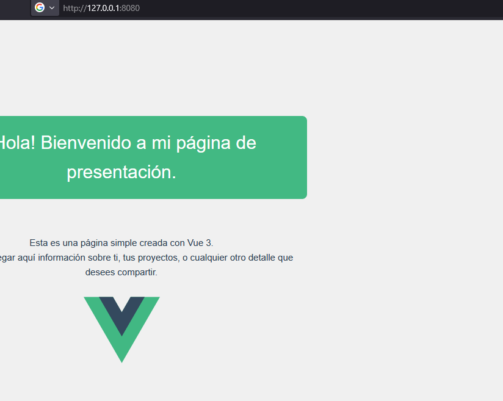
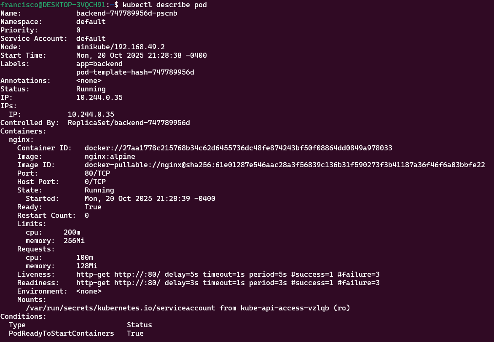
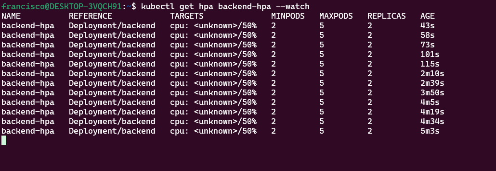
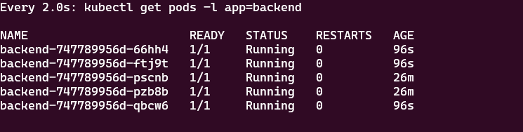
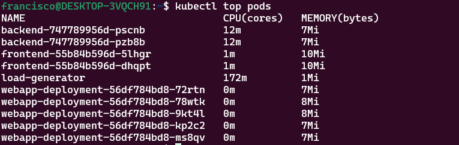

- Stack desplegado frontend vue + backend node js
- Conceptos aplicados (Ingress, health probes, HPA)

**b) Instrucciones de despliegue:**
1. Habilitar addons (ingress, metrics-server)
minikube addons enable metrics-server

minikube addons list

2. Aplicar manifests

kubectl apply -f frontend-deployment.yaml
kubectl apply -f frontend-service.yaml
kubectl apply -f backend-deployment.yaml
kubectl apply -f backend-service.yaml
kubectl apply -f ingress.yaml
kubectl apply -f hpa.yaml

3. Verificar recursos
kubectl top pods
NAME                                 CPU(cores)   MEMORY(bytes)
backend-747789956d-66hh4             6m           7Mi
backend-747789956d-ftj9t             6m           7Mi
backend-747789956d-pscnb             6m           7Mi
backend-747789956d-pzb8b             5m           7Mi
backend-747789956d-qbcw6             5m           7Mi
frontend-55b84b596d-5lhgr            1m           10Mi
frontend-55b84b596d-dhqpt            1m           10Mi
load-generator                       175m         1Mi
webapp-deployment-56df784bd8-72rtn   0m           7Mi
webapp-deployment-56df784bd8-78wtk   0m           8Mi
webapp-deployment-56df784bd8-9kt4l   0m           8Mi
webapp-deployment-56df784bd8-kp2c2   0m           7Mi
webapp-deployment-56df784bd8-ms8qv   0m           7Mi

4. Probar Ingress

http://192.168.49.2:8080/

5. Probar HPA con carga

 kubectl run load-generator --image=busybox:1.28 --rm -it --restart=Never -- /bin/sh -c "while sleep 0.01; do wget -q -O- http://backend-service; done"

**c) Comandos de verificación:**

kubectl get all

NAME                                     READY   STATUS    RESTARTS      AGE
pod/backend-747789956d-66hh4             1/1     Running   0             13m
pod/backend-747789956d-ftj9t             1/1     Running   0             13m
pod/backend-747789956d-pscnb             1/1     Running   0             38m
pod/backend-747789956d-pzb8b             1/1     Running   0             38m
pod/backend-747789956d-qbcw6             1/1     Running   0             13m
pod/frontend-55b84b596d-5lhgr            1/1     Running   0             39m
pod/frontend-55b84b596d-dhqpt            1/1     Running   0             39m
pod/load-generator                       1/1     Running   0             59m
pod/webapp-deployment-56df784bd8-72rtn   1/1     Running   1 (81m ago)   4d
pod/webapp-deployment-56df784bd8-78wtk   1/1     Running   1 (81m ago)   4d
pod/webapp-deployment-56df784bd8-9kt4l   1/1     Running   1 (81m ago)   4d
pod/webapp-deployment-56df784bd8-kp2c2   1/1     Running   1 (81m ago)   4d
pod/webapp-deployment-56df784bd8-ms8qv   1/1     Running   1 (81m ago)   4d

kubectl get ingress

NAME          CLASS   HOSTS   ADDRESS        PORTS   AGE
app-ingress   nginx   *       192.168.49.2   80      38m

kubectl get hpa

NAME     REFERENCE     TARGETS          MINPODS   MAXPODS   REPLICAS   AGE
backend  Deployment/backend   cpu: <unknown>/50%   2         5      5        61m
backend-hpa   Deployment/backend   cpu: <unknown>/50%   2    5      5        35m

kubectl top pods

NAME                                 CPU(cores)   MEMORY(bytes)
backend-747789956d-66hh4             5m           7Mi
backend-747789956d-ftj9t             6m           7Mi
backend-747789956d-pscnb             5m           7Mi
backend-747789956d-pzb8b             5m           7Mi
backend-747789956d-qbcw6             6m           7Mi
frontend-55b84b596d-5lhgr            1m           10Mi
frontend-55b84b596d-dhqpt            1m           10Mi
load-generator                       175m         1Mi
webapp-deployment-56df784bd8-72rtn   0m           7Mi
webapp-deployment-56df784bd8-78wtk   0m           8Mi
webapp-deployment-56df784bd8-9kt4l   0m           8Mi
webapp-deployment-56df784bd8-kp2c2   0m           7Mi
webapp-deployment-56df784bd8-ms8qv   0m           7Mi

**d) Capturas de pantalla:**
1. 
2. 
3.  
4. 
5. 

**e) Comandos de limpieza:**

kubectl delete ingress app-ingress

ingress.networking.k8s.io "app-ingress" deleted from default namespace

kubectl delete hpa backend-hpa

horizontalpodautoscaler.autoscaling "backend-hpa" deleted from default namespace

kubectl delete service frontend-service backend-service

service "frontend-service" deleted from default namespace
service "backend-service" deleted from default namespace

kubectl delete deployment frontend backend

deployment.apps "frontend" deleted from default namespace
deployment.apps "backend" deleted from default namespace